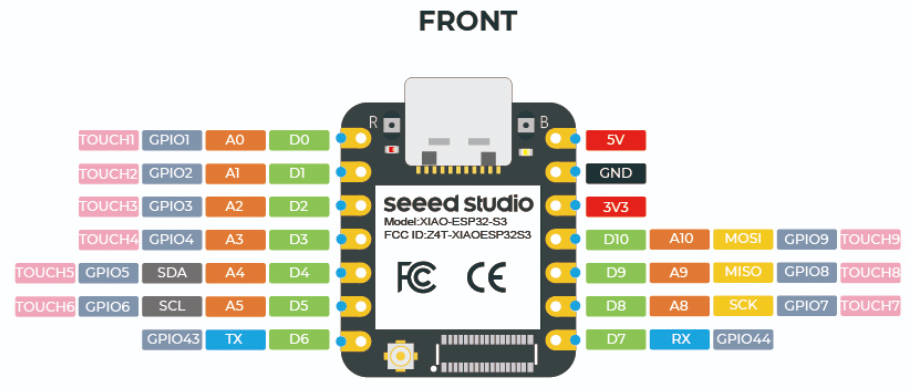

This is a repository for my digital altimeter based on the ESP32-S3 microcontroller. It uses an I2C interfaced pressure/temperature sensor board based on the MS5637 chip and an 84x48 SPI interfaced lcd screen based on the PCD8544 chip. The electronics is housed in the enclosure used by an old analog skydiving altimeter.

When switched on the altimeter sets to zero, so as to give you the height above ground in thousands of feet. It displays the height in large numerical characters to the nearest 100 feet, with the remaining altitude < 100 ft in a very small font.

